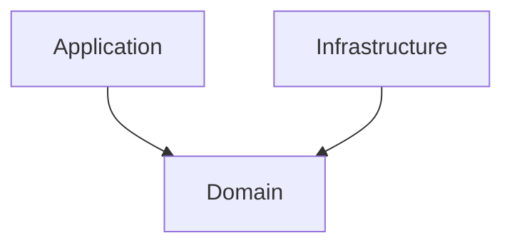

# Hexagonal Architecture

## Principle

### Directories
* **domain**:
* **application**: 
* **infrastructure**: 

### Dependency


## Run

```bash
git clone git@github.com:JDUcraft/golang-hexagonal-architecture.git
cd golang-hexagonal-architecture
go run .
```

## Dependency graph



